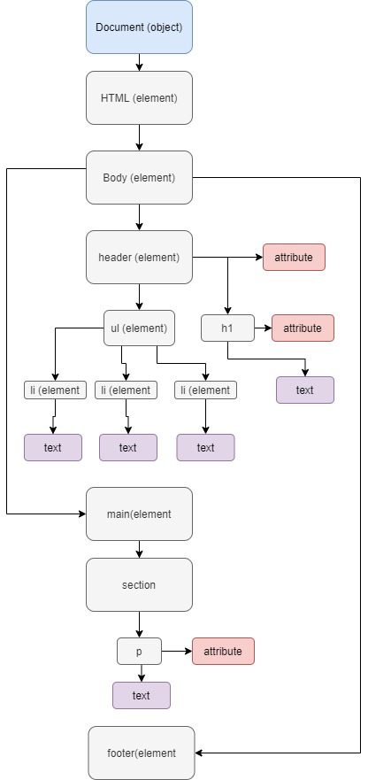

Jason D

### Object Literals

* Object Literal example:
```javascript
const = someOject{
    name: 'someName',
    verb: 'running',
    number: 2,
    isFast: true,
};
```

### The DOM

* Document Object Model.


